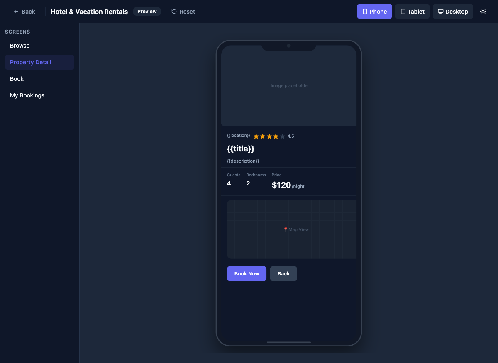

# Fix Detail Screen Data Binding in Live Preview

## Priority
P0

## Category
preview

## Description
When navigating from the Browse screen to the Property Detail screen in the Live Preview, template variables (`{{title}}`, `{{location}}`, `{{description}}`) are displayed as raw strings instead of being resolved to actual data values. The image also shows "Image placeholder" instead of the property's image URL. Interestingly, some fields like Guests, Bedrooms, and Price ARE correctly bound, suggesting the issue is with how the selected item's context is passed to text components that use mustache-style bindings.

## Current State
- Browse screen correctly renders all 5 properties with real data from the datasource
- Clicking "View" navigates to Property Detail screen
- `{{title}}`, `{{location}}`, `{{description}}` show as literal template strings
- Image shows "Image placeholder"
- Guests (4), Bedrooms (2), Price ($120/night) display correctly — these appear to be hardcoded or differently bound

## Proposed State
- All template variables resolve to the selected property's data
- Image displays the property's image from the datasource
- Consistent binding behavior across all component types

## Improvement Points
- The SDUI runtime's template resolver may not be receiving the navigation context (selected item) for text-type components
- Image component may need a different binding mechanism than text components
- This is the most critical bug as it breaks the core value proposition of the SDUI preview

## Acceptance Criteria
- [ ] `{{title}}` resolves to the property name (e.g., "Cozy Mountain Cabin")
- [ ] `{{location}}` resolves to the property location (e.g., "Aspen, Colorado")
- [ ] `{{description}}` resolves to the property description
- [ ] Image displays the property's image URL from the datasource
- [ ] Rating displays the correct value for the selected property
- [ ] All 5 properties show correct data when navigated to individually

## Estimated Complexity
Medium

## Suggested Skills
QA skill to automatically verify data binding across all screens after fixes
