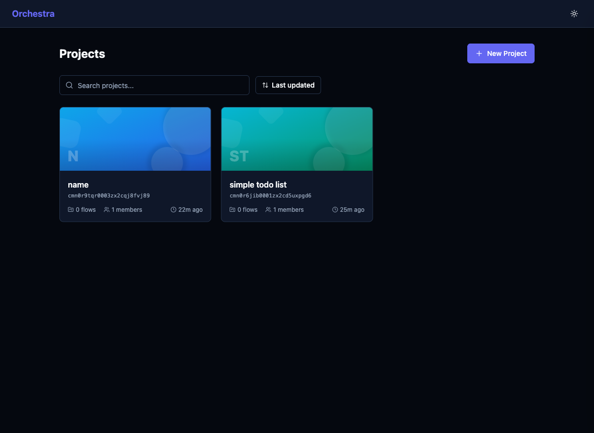

# Fix New Project Dialog Scroll Overflow

## Priority
P1

## Category
ux-bug

## Description
The "New Project" dialog's template selection area overflows the viewport. When there are 4+ templates (Blank, TODO List, BnB Rentals, Event Distance), the bottom templates and the Create/Cancel buttons are outside the visible area. Standard Playwright click actions fail with "element is outside of the viewport" errors. Users on smaller screens won't be able to see or click the lower templates or the action buttons.

## Current State
- Dialog opens with template list that extends beyond viewport
- BnB Rentals and Event Distance template buttons cannot be clicked via standard interaction
- Create Project and Cancel buttons are off-screen
- Requires JavaScript `scrollIntoView` + `el.click()` workaround to interact

## Proposed State
- Dialog content is scrollable within a max-height container
- All templates are accessible via scrolling within the dialog
- Action buttons (Create/Cancel) are pinned at the bottom of the dialog (sticky footer)
- Dialog works correctly on all viewport sizes (including 768px height)

## Improvement Points
- Add `max-height` and `overflow-y: auto` to the dialog content area
- Consider making the footer (Create/Cancel buttons) sticky with `position: sticky; bottom: 0`
- Test with varying viewport heights

## Acceptance Criteria
- [ ] All 4+ templates are accessible by scrolling within the dialog
- [ ] Create and Cancel buttons are always visible (sticky footer)
- [ ] Dialog works on viewports as small as 600px height
- [ ] No content is clipped or hidden without a scroll indicator

## Estimated Complexity
Small
