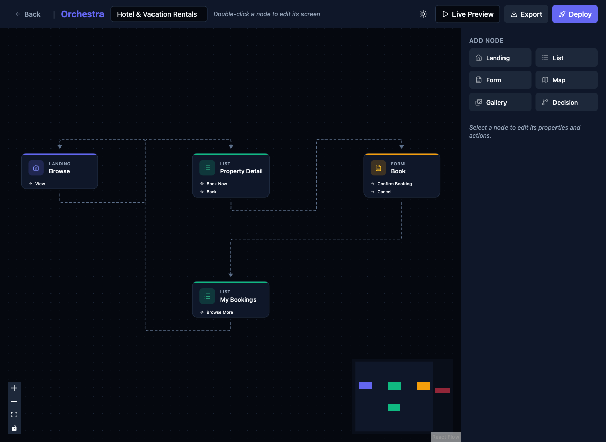

# Improve New Node Placement in Flow Editor

## Priority
P1

## Category
flow-editor

## Description
When adding a new node via the "Add Node" panel, the node is placed at a default position far from existing nodes, often outside the visible viewport. Users can't see the node they just created without panning or using the minimap. The node should be placed in a visible, logical position near existing nodes.

## Current State
- Clicking "Gallery" (or any node type) in Add Node panel creates the node off-screen
- User must pan or use minimap to find the new node
- No visual feedback that a node was created (no auto-pan, no highlight)

## Proposed State
- New nodes are placed in the center of the current viewport
- Or: placed to the right/below the last selected node with smart spacing
- Viewport auto-pans to show the new node
- New node briefly highlights/pulses to draw attention

## Improvement Points
- Calculate center of current viewport bounds for placement
- If a node is selected, place the new node relative to it (e.g., 200px to the right)
- Auto-fit view after adding a node, or smooth-pan to the new node
- Add a brief animation on the new node

## Acceptance Criteria
- [ ] New nodes appear within the visible viewport area
- [ ] New nodes don't overlap existing nodes
- [ ] User can immediately see and interact with the newly created node
- [ ] Optional: new node has a brief highlight animation

## Estimated Complexity
Small
