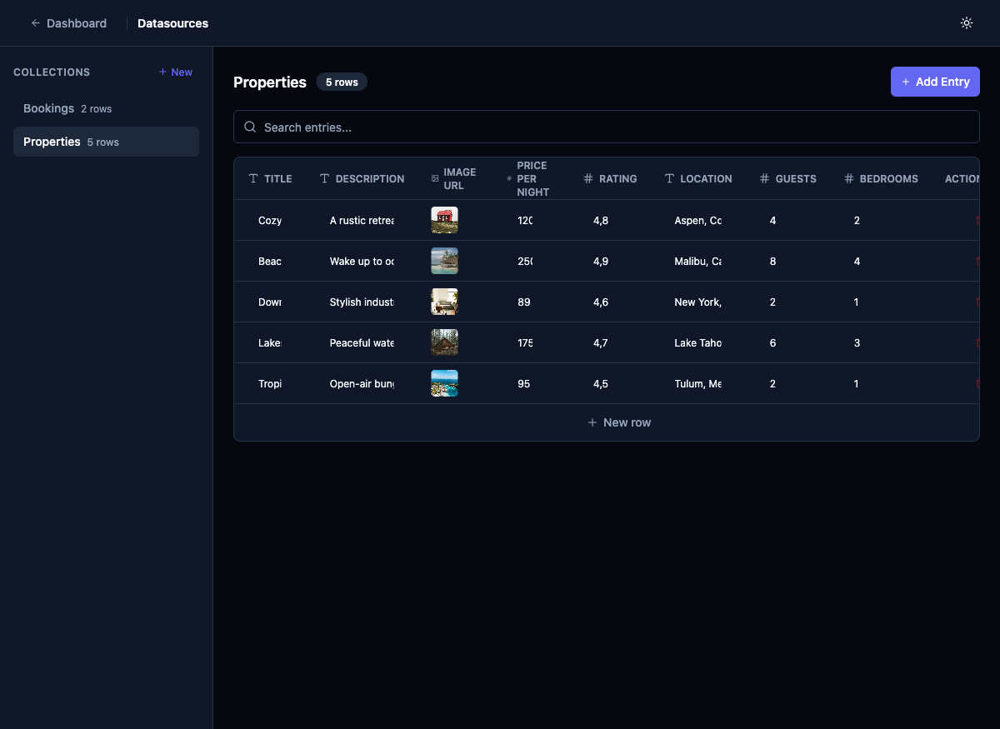

# Add Datasource Schema Editor

## Priority
P2

## Category
datasource

## Description
Currently, datasource collections display data in a table with typed columns (text, number, image URL), but there's no visible way to add, remove, rename, or reorder fields/columns from the UI. Users building new apps need to define custom schemas for their datasources. The field types are shown with icons (T for text, # for number, image icon for URL) but there's no schema management interface.

## Current State
- Collections show data in a table with pre-defined columns
- Column headers show type icons but are not editable
- No "Add Column", "Edit Column", or "Delete Column" affordances visible
- Templates pre-create schemas but users can't modify them

## Proposed State
- "Add Field" button in the table header area
- Right-click or menu on column headers to rename, change type, or delete
- Field type selector dropdown (text, number, image URL, boolean, date, geolocation, select, etc.)
- Drag to reorder columns
- Field validation rules (required, min/max, regex)

## Improvement Points
- Schema editor could be a slide-out panel or modal
- Support for all existing field types plus new ones (boolean, date, enum/select, JSON, relation)
- Consider a "Schema" tab next to the data table view
- Relations between collections (foreign keys) would be a P3 follow-up

## Acceptance Criteria
- [ ] Users can add new fields to a collection with a name and type
- [ ] Users can rename existing fields
- [ ] Users can delete fields (with confirmation)
- [ ] Users can change field types (with data migration warning)
- [ ] Supported types: text, number, image URL, boolean, date, geolocation

## Estimated Complexity
Large
