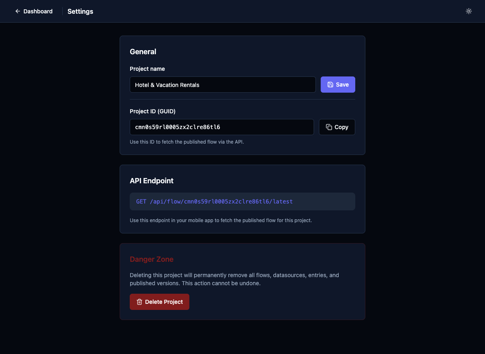

# Enhance Settings Page with Team & Deploy History

## Priority
P2

## Category
infrastructure

## Description
The Settings page currently only has General (project name, ID), API Endpoint display, and Danger Zone (delete). The header mentions "Team members, deploy config, API keys" but none of these are implemented. For a collaborative SDUI platform, team management and deploy history are essential.

## Current State
- General: project name (editable), project GUID (copyable)
- API Endpoint: displays GET URL
- Danger Zone: delete project button
- No team member management
- No deploy history or versioning UI
- No API key management
- No environment configuration

## Proposed State
- **Team Members** section: invite by email, role management (admin/editor/viewer), member list with avatars
- **Deploy History** section: table of deployments with version, timestamp, deployer, rollback button
- **API Keys** section: generate/revoke API keys for mobile app authentication
- **Environment Config**: dev/staging/production environment toggles

## Improvement Points
- Team management requires auth system (may be blocked by auth implementation)
- Deploy history can be built from existing version data in the API
- API keys section is important for securing the published flow endpoint
- Start with deploy history as it has the fewest dependencies

## Acceptance Criteria
- [ ] Deploy history shows all published versions with timestamps
- [ ] Users can rollback to a previous version from the deploy history
- [ ] Settings page sections match the card description ("Team members, deploy config, API keys")

## Estimated Complexity
Large
