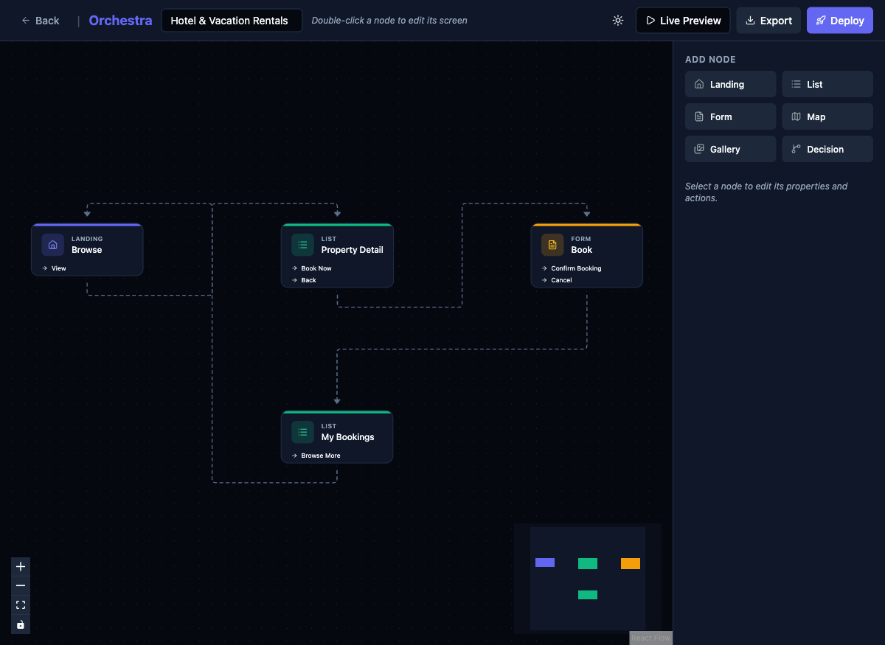

# Add Profile/Detail Screen Node Type

## Priority
P2

## Category
flow-editor

## Description
The Flow Editor offers 6 node types: Landing, List, Form, Map, Gallery, Decision. A common mobile app pattern missing is a **Profile/Detail** screen type — used for user profiles, item detail views, about pages, and settings screens. Currently, the "List" type is being repurposed for detail views (e.g., "Property Detail" uses "list" type), which is semantically incorrect.

## Current State
- Available node types: Landing, List, Form, Map, Gallery, Decision
- Detail/Profile screens are built using the "List" type (semantic mismatch)
- Property Detail node shows as "list" type in the flow editor

## Proposed State
- New "Detail" or "Profile" node type with appropriate icon
- Pre-configured layout: hero image, title, subtitle, description, metadata grid, action buttons
- Screen builder template for detail views with common sections
- Consider also: "Settings" screen type (toggle list), "Chat" screen type

## Improvement Points
- The Detail type should have a distinct icon (e.g., user icon or card icon)
- Template should include common detail screen patterns: hero, info sections, CTA
- Existing templates should be updated to use Detail type where appropriate

## Acceptance Criteria
- [ ] "Detail" node type available in Add Node panel
- [ ] Detail node has a distinct icon and label
- [ ] Double-clicking creates a screen builder with detail-oriented default layout
- [ ] BnB template's "Property Detail" uses Detail type instead of List

## Estimated Complexity
Medium
