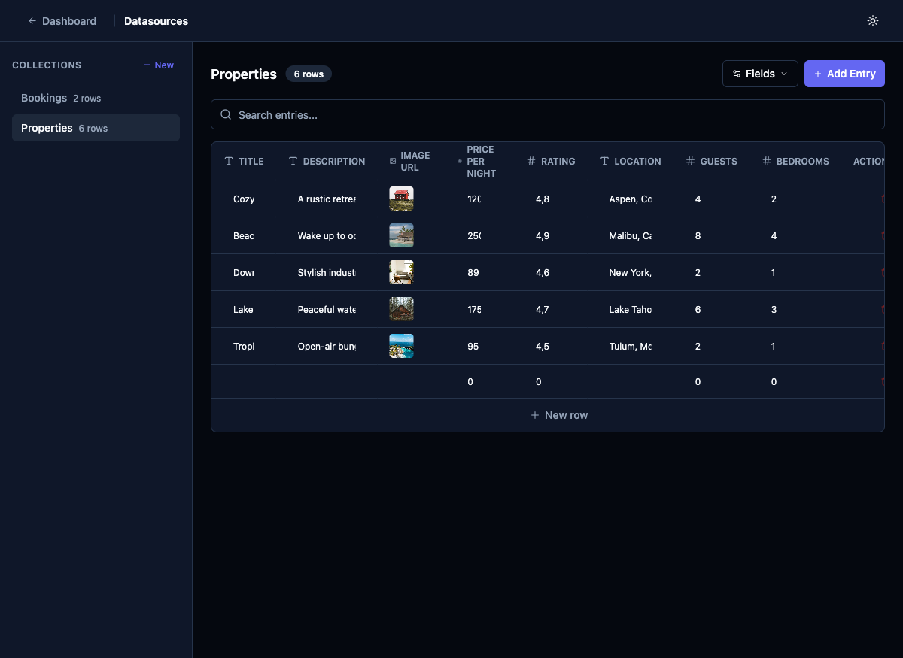

# Add Source Type to Datasource Model

## Priority
P0

## Category
datasource

## Description
Extend the Datasource Prisma model and shared types to support multiple source types. Currently, all datasources are implicitly "manual entry." We need to add a `sourceType` discriminator field and a `sourceConfig` JSON field to store source-specific configuration (e.g., REST endpoint details).

### Schema Changes

**Prisma (`packages/database/prisma/schema.prisma`):**
```prisma
model Datasource {
  id           String   @id @default(auto()) @map("_id") @db.ObjectId
  name         String
  projectId    String   @db.ObjectId
  fields       Json
  sourceType   String   @default("manual")  // "manual" | "rest"
  sourceConfig Json?                         // REST config, null for manual
  lastFetchAt  DateTime?                     // When data was last fetched from external source
  lastFetchStatus String?                    // "success" | "error" | "pending"
  lastFetchError  String?                    // Error message if last fetch failed
  createdAt    DateTime @default(now())
  updatedAt    DateTime @updatedAt

  project Project           @relation(fields: [projectId], references: [id], onDelete: Cascade)
  entries DatasourceEntry[]

  @@unique([projectId, name])
  @@map("datasources")
}
```

**Shared Types (`packages/shared/src/schemas/screen.ts`):**
```typescript
export const DatasourceSourceType = z.enum(['manual', 'rest']);

export const RestAuthConfig = z.discriminatedUnion('type', [
  z.object({ type: z.literal('none') }),
  z.object({ type: z.literal('bearer'), token: z.string() }),
  z.object({ type: z.literal('api_key'), key: z.string(), value: z.string(), in: z.enum(['header', 'query']) }),
  z.object({ type: z.literal('basic'), username: z.string(), password: z.string() }),
]);

export const RestSourceConfig = z.object({
  url: z.string().url(),
  method: z.enum(['GET', 'POST', 'PUT', 'PATCH']).default('GET'),
  headers: z.record(z.string(), z.string()).optional(),
  queryParams: z.record(z.string(), z.string()).optional(),
  body: z.string().optional(),
  auth: RestAuthConfig.default({ type: 'none' }),
  dataPath: z.string().optional(),           // JSONPath to extract array from response (e.g., "data.items")
  refreshIntervalMinutes: z.number().optional(), // Auto-refresh interval
});

export const DatasourceSourceConfig = z.discriminatedUnion('sourceType', [
  z.object({ sourceType: z.literal('manual') }),
  z.object({ sourceType: z.literal('rest'), rest: RestSourceConfig }),
]);
```

## Current State
The Datasource model has no concept of source type — all data is manually entered via the admin table UI.



## Proposed State
Every datasource carries a `sourceType` field. Existing datasources default to `"manual"`. REST datasources store their full configuration in `sourceConfig` and track fetch status via `lastFetchAt`, `lastFetchStatus`, and `lastFetchError`.

## Acceptance Criteria
- [ ] Prisma schema updated with new fields, migration applied
- [ ] Shared Zod schemas for `RestSourceConfig`, `RestAuthConfig`, and `DatasourceSourceConfig` exported
- [ ] Existing datasources unaffected (default to `sourceType: "manual"`)
- [ ] API create/update routes accept `sourceType` and `sourceConfig`
- [ ] Types are re-exported from `packages/shared`

## Estimated Complexity
Medium

## Suggested Skills
None — this is foundational schema work.
