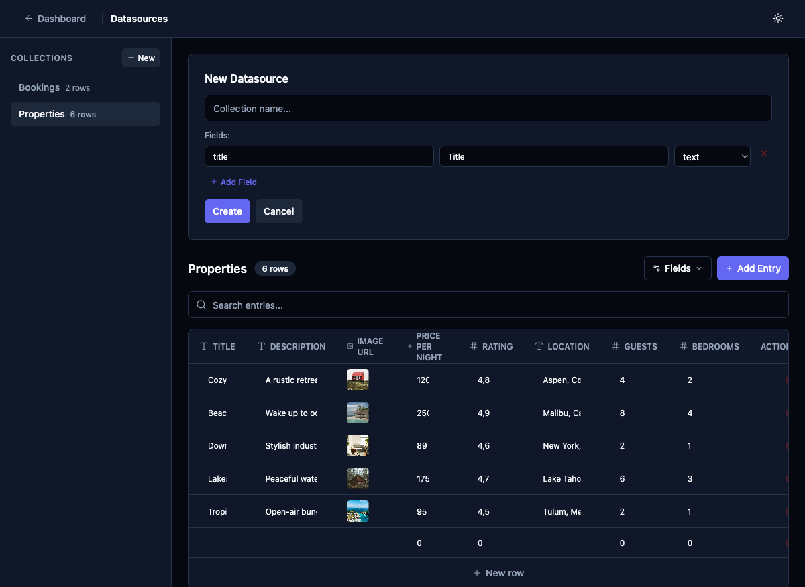

# Datasource Creation Wizard — Source Type Selection Step

## Priority
P0

## Category
datasource

## Description
Replace the current flat "New Datasource" form with a multi-step wizard. The first step asks the user to choose the source type before proceeding to configuration.

### Wizard Flow

```
Step 1: Source Type Selection
┌─────────────────────────────────────────┐
│  Create New Datasource                  │
│                                         │
│  Collection name: [_______________]     │
│                                         │
│  Choose data source:                    │
│                                         │
│  ┌──────────┐  ┌──────────────┐         │
│  │  📝      │  │  🌐          │         │
│  │  Manual  │  │  REST API    │         │
│  │  Entry   │  │  Service     │         │
│  └──────────┘  └──────────────┘         │
│                                         │
│              [Next →]                   │
└─────────────────────────────────────────┘

If Manual → Step 2: Fields (current form)
If REST   → Step 2: REST Configuration (Task 003)
                     → Step 3: Field Mapping (Task 005)
```

### Implementation

Create a new component `DatasourceWizard.tsx` in `apps/admin/src/components/datasources/` that:

1. **Step 1** — Name + source type selection (card-based toggle, similar to the template selector on the project creation page)
2. **Step 2 (Manual)** — Existing field definition form (reuse `SchemaEditor`)
3. **Step 2 (REST)** — REST configuration form (Task 003)
4. **Step 3 (REST)** — Test & field mapping (Task 005)
5. **Final** — Create button that POSTs to the API with `sourceType` and `sourceConfig`

Use a stepper/breadcrumb at the top so the user knows where they are.

## Current State
The "New Datasource" form is a single inline panel that only collects a name and field definitions — there is no source type choice.



## Proposed State
A multi-step wizard opens (either as a modal or replaces the right panel) with clear step indicators. Step 1 shows two source type cards. Selecting one reveals the relevant configuration form.

## Acceptance Criteria
- [ ] Wizard component created with step navigation (back/next/create)
- [ ] Step 1 shows collection name input and source type cards (Manual Entry, REST API)
- [ ] Selecting "Manual Entry" proceeds to the existing field editor
- [ ] Selecting "REST API" proceeds to the REST config form (Task 003)
- [ ] Step indicator shows current progress
- [ ] Cancel returns to the collection list without side effects
- [ ] Wizard state resets when reopened

## Estimated Complexity
Medium
