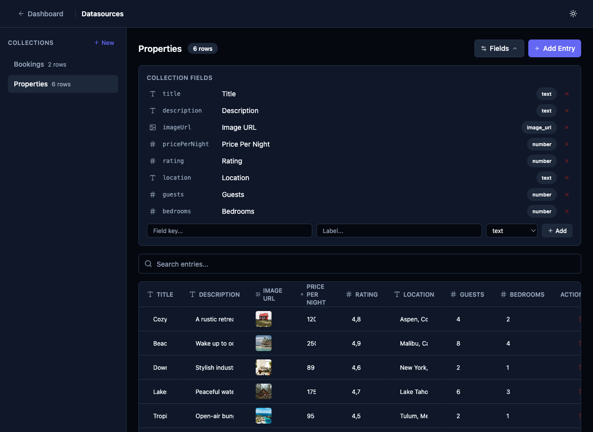

# REST Response Field Mapping Step

## Priority
P1

## Category
datasource

## Description
After the user configures the REST endpoint and tests the connection (Task 003 + 004), they need to map the response fields to the datasource schema. This is Step 3 of the wizard for REST datasources.

### Wizard Step Layout

```
Step 3: Map Response Fields
┌──────────────────────────────────────────────────────┐
│                                                      │
│  ✓ Connection successful — 24 items found            │
│                                                      │
│  Map response fields to your datasource schema:      │
│                                                      │
│  ┌─ Response Fields ──────── Datasource Fields ──┐   │
│  │  ☑ id (number)        →  [id        ] number  │   │
│  │  ☑ name (text)        →  [title     ] text    │   │
│  │  ☑ description (text) →  [description] text   │   │
│  │  ☑ price (number)     →  [price     ] number  │   │
│  │  ☑ image (url)        →  [imageUrl  ] img_url │   │
│  │  ☐ internal_id (text) →  (skipped)            │   │
│  │  ☐ metadata (object)  →  (skipped)            │   │
│  └───────────────────────────────────────────────┘   │
│                                                      │
│  Preview (first 3 rows):                             │
│  ┌────────┬────────────┬───────┬──────────────┐      │
│  │ title  │ description│ price │ imageUrl     │      │
│  ├────────┼────────────┼───────┼──────────────┤      │
│  │ Cozy   │ A rustic...│ 120   │ https://...  │      │
│  │ Beach  │ Wake up ..│ 250   │ https://...  │      │
│  │ Loft   │ Stylish ..│ 89    │ https://...  │      │
│  └────────┴────────────┴───────┴──────────────┘      │
│                                                      │
│  [← Back]                          [Create →]        │
└──────────────────────────────────────────────────────┘
```

### Key Behaviors

1. **Auto-populate** — Use the detected fields from the test response (Task 004) to pre-fill the mapping. Auto-generate `key` (camelCase) and `label` (Title Case) from the response field names.
2. **Checkboxes** — Each response field has a checkbox. Unchecked fields are skipped (not imported).
3. **Editable mapping** — Users can rename the key/label and change the type for each mapped field.
4. **Type coercion hints** — If a detected type doesn't match the user's chosen type, show a warning.
5. **Preview table** — Show the first 3 rows of transformed data using the current mapping.
6. **Object/array fields** — Response fields that are objects or arrays show "(complex — skipped)" by default, with an option to flatten or stringify.

### Component

`apps/admin/src/components/datasources/FieldMappingStep.tsx`

## Current State
No field mapping exists — fields are manually defined one by one.



## Proposed State
An interactive mapping UI that connects response fields to datasource fields with live preview of transformed data.

## Acceptance Criteria
- [ ] Auto-detected fields from test response are listed with checkboxes
- [ ] Each field row shows: checkbox, source field name, detected type, editable key, editable label, type selector
- [ ] Unchecked fields are excluded from the datasource schema
- [ ] Preview table shows first 3 rows with the current mapping applied
- [ ] Users can rename keys/labels and change types
- [ ] Type mismatch warnings shown (e.g., mapping a string field to number)
- [ ] Complex fields (objects/arrays) handled gracefully
- [ ] State flows correctly: back returns to REST config, forward creates the datasource

## Estimated Complexity
Large
